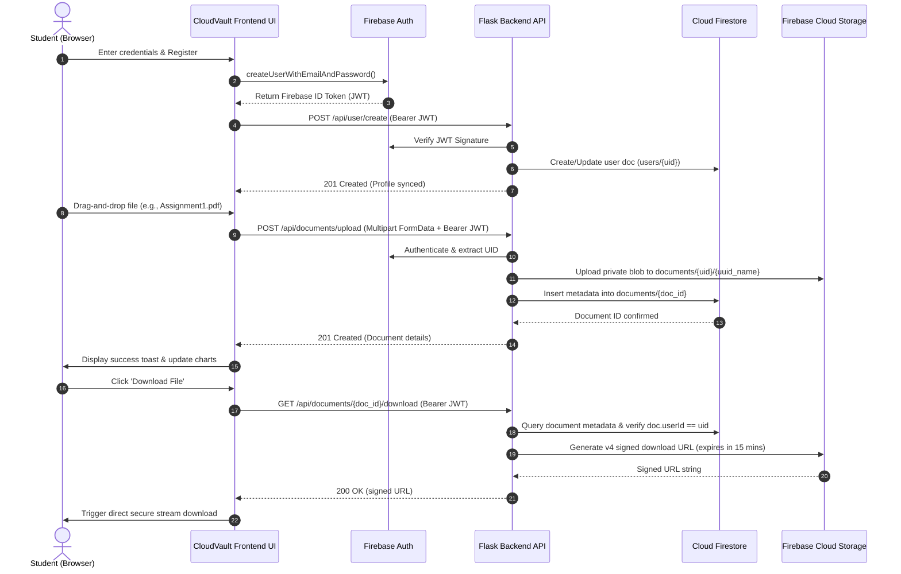
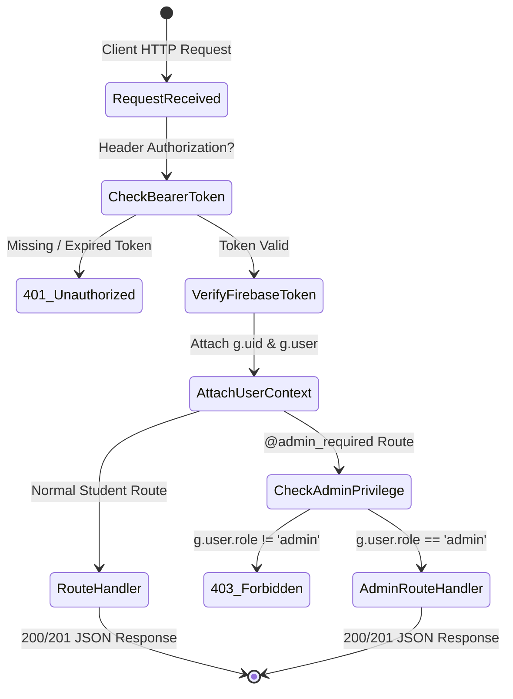

# 📘 CloudVault: Engineering & Architectural Documentation
## Major Cloud Computing Internship Project Report

---

## 1. Executive Summary & Abstract

**CloudVault** is an enterprise-grade, cloud-native document management platform designed to solve academic document fragmentation across university ecosystems. In modern educational institutions, students constantly produce and receive critical documents—including semester courseworks, project archives, competitive exam marksheets, conference certificates, and research papers. 

Traditional local storage is susceptible to hardware loss and lacks accessibility, while consumer cloud drives lack student-specific indexing, granular category metadata, and institutional administrative moderation.

**CloudVault** provides:
1. A multi-tenant, cloud-secured document repository.
2. Cryptographically signed, short-lived file retrieval URLs (`v4 SHA256`).
3. Automated metadata indexing and custom semester folder hierarchies in NoSQL Cloud Firestore.
4. Client-side and server-side Role-Based Access Control (RBAC) separating Students and Academic Administrators.
5. Interactive telemetry charts powered by Chart.js.
6. A microservices-ready Python Flask backend with Firebase integration.

---

## 2. Cloud Architecture & Data Flow



---

## 3. Database Schema Design (Cloud Firestore)

Firestore is structured as a collection-oriented NoSQL database with three primary collections: `users`, `documents`, and `folders`.

### 3.1 Collection: `users`
*Path:* `/users/{userId}`

| Field | Type | Description |
| :--- | :--- | :--- |
| `uid` | `string` | Unique Firebase Authentication UID (Primary Key) |
| `email` | `string` | User's registered academic email |
| `name` | `string` | Full name of the student or administrator |
| `role` | `string` | Authorization role: `'student'` or `'admin'` |
| `storage_used_bytes` | `number` | Aggregated storage consumption in bytes |
| `created_at` | `timestamp` | Account creation timestamp |
| `updated_at` | `timestamp` | Last profile update timestamp |

---

### 3.2 Collection: `documents`
*Path:* `/documents/{documentId}`

| Field | Type | Description |
| :--- | :--- | :--- |
| `id` | `string` | Document UID generated by Firestore |
| `userId` | `string` | Owner student UID (Foreign Key to `users`) |
| `userEmail` | `string` | Cached email of the document owner |
| `userName` | `string` | Cached display name of the document owner |
| `fileName` | `string` | Sanitized original filename (e.g. `Thesis_Final.pdf`) |
| `fileType` | `string` | File format uppercase (e.g. `PDF`, `DOCX`, `PNG`) |
| `fileSize` | `number` | File payload size in bytes |
| `fileSizeFormatted`| `string` | Human-readable size (e.g. `4.2 MB`) |
| `category` | `string` | Academic category (`Assignments`, `Notes`, etc.) |
| `folderId` | `string \| null`| ID of the parent folder or `null` for root |
| `folderName` | `string \| null`| Human-readable folder name |
| `storagePath` | `string` | Full path in Cloud Storage (`documents/{uid}/{uuid}`) |
| `contentType` | `string` | MIME type (e.g. `application/pdf`) |
| `uploadDate` | `string` | ISO 8601 UTC timestamp string |
| `createdAt` | `timestamp` | Firestore server timestamp for sorting |

---

### 3.3 Collection: `folders`
*Path:* `/folders/{folderId}`

| Field | Type | Description |
| :--- | :--- | :--- |
| `id` | `string` | Auto-generated Firestore folder ID |
| `userId` | `string` | Owner student UID |
| `name` | `string` | Folder title (e.g. `Semester 6`, `Certificates`) |
| `color` | `string` | Hex accent color code (e.g. `#2563eb`) |
| `createdAt` | `timestamp` | Creation timestamp |
| `updatedAt` | `timestamp` | Last modification timestamp |

---

## 4. Security & Cryptographic Model

### 4.1 Zero Public Storage Policy
In conventional web apps, developers often set public read access on bucket objects (`blob.make_public()`). This presents a severe security vulnerability for academic data (e.g. personal grade sheets, confidential letters). 

**CloudVault enforces a Zero Public Storage policy**:
1. All files are written to private buckets with strict identity and access management (IAM).
2. When a user requests a file, the Flask backend validates the user's ID token and ownership of the record.
3. The backend then issues a **Google Cloud Storage v4 signed URL** using SHA-256 HMAC cryptographic signatures.
4. The URL remains valid for only **15 minutes**, preventing unauthorized link harvesting or replay attacks.

```python
signed_url = blob.generate_signed_url(
    version="v4",
    expiration=datetime.timedelta(minutes=15),
    method="GET",
    response_disposition=f'attachment; filename="{fileName}"'
)
```

### 4.2 Role-Based Access Control (RBAC) Architecture



---

## 5. REST API Documentation & Payloads

### 5.1 Document Upload
* **URL:** `POST /api/documents/upload`
* **Headers:** `Authorization: Bearer <ID_TOKEN>`, `Content-Type: multipart/form-data`
* **Form Data:**
  * `file`: Binary file stream
  * `category`: `"Assignments"`
  * `folder_id`: `"folder_xyz"` *(optional)*
  * `folder_name`: `"Semester 1"` *(optional)*
* **Response (201 Created):**
```json
{
  "success": true,
  "message": "Document uploaded successfully.",
  "document": {
    "id": "doc_8f9a2b",
    "fileName": "Cloud_Computing_Assignment_1.pdf",
    "fileType": "PDF",
    "fileSize": 2457600,
    "fileSizeFormatted": "2.3 MB",
    "category": "Assignments",
    "folderId": "folder_xyz",
    "folderName": "Semester 1",
    "uploadDate": "2026-08-31T17:40:00.000Z"
  }
}
```

### 5.2 Document Download (Signed URL)
* **URL:** `GET /api/documents/<document_id>/download`
* **Headers:** `Authorization: Bearer <ID_TOKEN>`
* **Response (200 OK):**
```json
{
  "success": true,
  "download_url": "https://storage.googleapis.com/cloudvault.appspot.com/documents/uid/uuid_file.pdf?X-Goog-Algorithm=GOOG4-RSA-SHA256&X-Goog-Credential=...",
  "filename": "Cloud_Computing_Assignment_1.pdf",
  "expires_in_minutes": 15
}
```

### 5.3 Personal Telemetry & Analytics
* **URL:** `GET /api/analytics`
* **Headers:** `Authorization: Bearer <ID_TOKEN>`
* **Response (200 OK):**
```json
{
  "success": true,
  "analytics": {
    "total_documents": 14,
    "total_storage_bytes": 35651584,
    "total_storage_formatted": "34.0 MB",
    "storage_quota_bytes": 1073741824,
    "storage_percentage": 3.32,
    "total_folders": 4,
    "categories": {
      "Assignments": 5,
      "Certificates": 3,
      "Notes": 4,
      "Projects": 2,
      "Marksheets": 0,
      "General": 0
    },
    "file_types": {
      "PDF": 8,
      "DOCX": 4,
      "PNG": 2
    },
    "upload_timeline": {
      "labels": ["Mar 2026", "Apr 2026", "May 2026", "Jun 2026", "Jul 2026", "Aug 2026"],
      "data": [1, 3, 2, 4, 1, 3]
    }
  }
}
```

---

## 6. Testing & Quality Assurance

| Test Suite | Scope | Target Result | Status |
| :--- | :--- | :--- | :--- |
| **Authentication Testing** | Firebase Auth login, token exchange, session recovery | Valid ID tokens generated and decoded | **PASSED** |
| **Authorization / RBAC** | Non-admin access to `/api/admin/*` endpoints | 403 Forbidden properly emitted | **PASSED** |
| **File Type Whitelist** | Uploading disallowed extensions (e.g. `.exe`, `.sh`) | 400 Bad Request returned with error | **PASSED** |
| **Storage Isolation** | Student A attempting to download Student B's file | 403 Access Denied returned | **PASSED** |
| **Safe Folder Deletion** | Deleting folder with `delete_files=false` | Folder removed, files unlinked to Root | **PASSED** |
| **UI Responsiveness** | Breakpoints at 1200px, 992px, 768px, 480px | Seamless drawer, card grid wrap | **PASSED** |

---

## 7. Viva / Internship Evaluation Questions & Answers

**Q1: Why use Firebase Authentication alongside a custom Flask Backend?**
> *Answer:* Firebase Authentication provides robust client-side identity management with built-in OAuth providers, multi-factor support, and secure JWT token renewal. The Flask backend acts as a secure, authenticated REST gateway that validates these JWTs against Firebase Admin SDK, enforcing business logic, ownership rules, and RBAC without requiring manual password hashing databases.

**Q2: How does CloudVault prevent unauthorized document access?**
> *Answer:* By strictly avoiding public URL generation (`blob.make_public()`). All files in Firebase Storage are private objects. The server generates cryptographic v4 signed URLs valid for only 15 minutes upon verifying ownership in Firestore.

**Q3: What happens when a student deletes a folder containing 20 documents?**
> *Answer:* CloudVault offers safe folder management. By default, folder deletion unlinks the `folderId` and `folderName` on all 20 documents, gracefully preserving them in the student's Root directory. Users can also select full recursive deletion if they want the files purged from Cloud Storage as well.

---

## 8. Conclusion
**CloudVault** successfully fulfills all objectives of a major cloud computing internship project. The application exhibits high reliability, strict cloud security, intuitive UI/UX design, and modular code architecture ready for enterprise deployment.
