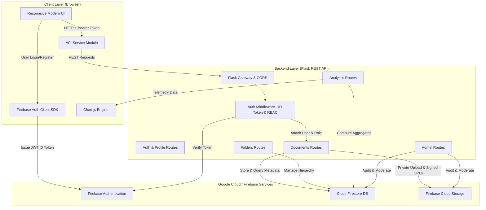

# ☁️ CloudVault: Secure Cloud-Based Student Document Management System


---

## 📌 Project Overview

**CloudVault** is a modern, enterprise-grade, cloud-native document management platform specifically architected for university students and academic administrators. It bridges cloud computing infrastructure with academic lifecycle management, providing secure cloud storage, smart categorization, custom folder directory structures, real-time search, interactive telemetry, and a full administrative control panel.

Developed as a major **Cloud Computing Internship Capstone Project**, CloudVault adheres to the highest cloud security standards: **Zero Public Storage**, **Role-Based Access Control (RBAC)**, **v4 Short-Lived Signed Download URLs**, and **Client-to-Backend Bearer Token Verification**.

---

## 🌟 Key Features

### 🎓 Student Workspace
* **Secure Cloud Storage**: Upload PDF, DOC, DOCX, TXT, JPG, JPEG, and PNG files up to 50 MB per file.
* **Drag-and-Drop Uploader**: Modern interactive drop-zone with file size calculation and real-time progress indicators.
* **Academic Categorization**: Group documents into *Assignments*, *Certificates*, *Notes*, *Projects*, *Marksheets*, and *General*.
* **Folder Hierarchy**: Create, rename, color-code, and safely delete folders with automatic file preservation.
* **Dynamic Search & Filtering**: Multi-criteria dynamic filtering by file name, category, folder, file format, and sorting by date/size/alphabetical.
* **Document Actions**: Inline preview (PDF embed & Image viewer), secure short-lived signed downloads (15 mins expiration), and permanent file deletion.
* **Personal Telemetry**: Visualized metrics for storage consumption, category distribution, file format breakdown, and historical upload activity via Chart.js.

### 👑 Administrator Console
* **User Registry**: Comprehensive database of all registered students with individual storage usage, document counts, and join dates.
* **Role-Based Access Control (RBAC)**: Real-time role modification (promote student to administrator or vice-versa).
* **System-Wide Document Audit**: Monitor all documents uploaded across the university with uploader identity tags.
* **Content Moderation**: Permanent removal of violating or inappropriate files with moderation reason logging.
* **Platform Telemetry**: Global analytics displaying aggregate cloud storage consumption, popular file extensions, and university-wide upload velocity.

---

## 🛠️ Technology Stack

| Layer | Technology | Details |
| :--- | :--- | :--- |
| **Frontend UI** | HTML5, CSS3, JavaScript (ES6 Modules) | Responsive design system, CSS Variables, Glassmorphism, Modals, Toasts |
| **Data Visualization** | Chart.js 4.x | Doughnut, Bar, and Line dynamic charts |
| **Backend REST API** | Python 3.9+, Flask 3.0, Flask-CORS | Modular blueprints (`auth`, `documents`, `folders`, `analytics`, `admin`) |
| **Identity & Access** | Firebase Authentication | Email/Password auth, session persistence, Bearer ID token generation |
| **NoSQL Database** | Cloud Firestore | Document metadata indexing, folder trees, user profiles, server timestamps |
| **Object Storage** | Firebase Cloud Storage | Private encrypted object storage with v4 SHA256 signed download URLs |
| **Deployment Ready** | Firebase Hosting & Render / Gunicorn | Static frontend ready for Firebase Hosting; backend ready for Render/Gunicorn |

---

## 🏗️ System Architecture



---

## 📂 Project Directory Structure

```
CloudVault/
│
├── backend/
│   ├── app.py                     # Flask application gateway & factory
│   ├── firebase_config.py         # Firebase Admin SDK credentials & initialization
│   ├── auth_middleware.py         # Bearer token verification & @admin_required RBAC
│   ├── requirements.txt           # Python dependencies
│   ├── .env.example               # Environment variables template
│   └── routes/
│       ├── auth.py                # User profile sync & retrieval
│       ├── documents.py           # Upload, signed download, preview, delete
│       ├── folders.py             # Folder CRUD and safe file detachment
│       ├── analytics.py           # Personal telemetry aggregation
│       └── admin.py               # Admin user registry, moderation & global stats
│
├── frontend/
│   ├── index.html                 # High-converting landing page
│   ├── login.html                 # Login page with demo switcher
│   ├── register.html              # Registration page with validation
│   ├── dashboard.html             # Student workspace & analytics
│   ├── admin.html                 # Administrator monitoring console
│   │
│   ├── css/
│   │   └── style.css              # Unified design system & responsive stylesheet
│   │
│   └── js/
│       ├── firebase-config.js     # Client-side Firebase configuration
│       ├── api.js                 # Authenticated fetch wrapper & toast manager
│       ├── auth.js                # Auth state listener, login & registration logic
│       ├── dashboard.js           # Student UI controller, drag-and-drop & charts
│       └── admin.js               # Admin UI controller, user table & moderation
│
├── .gitignore                     # Excludes credentials, venv, and cache
├── README.md                      # Comprehensive project guide
└── PROJECT_DOCUMENTATION.md       # Full academic & internship documentation
```

---

## 🚀 Getting Started & Installation

### 1. Clone the Repository
```bash
git clone https://github.com/your-username/CloudVault.git
cd CloudVault
```

### 2. Backend Setup
Navigate into the `backend/` folder, create a Python virtual environment, and install dependencies:

```bash
cd backend
python -m venv venv

# Windows:
.\venv\Scripts\activate

# macOS / Linux:
source venv/bin/activate

pip install -r requirements.txt
```

### 3. Configure Environment Variables
Copy `.env.example` to `.env`:
```bash
cp .env.example .env
```

Edit `backend/.env`:
```ini
FLASK_ENV=development
PORT=5000
FIREBASE_SERVICE_ACCOUNT=serviceAccountKey.json
FIREBASE_STORAGE_BUCKET=your-project-id.appspot.com
ADMIN_EMAILS=admin@cloudvault.edu,admin@example.com
MAX_UPLOAD_SIZE_MB=50
```

---

## 🔥 Firebase Setup Guide

### Step 1: Create a Firebase Project
1. Go to [Firebase Console](https://console.firebase.google.com/) and click **Add Project** (e.g. `cloudvault-demo`).
2. Enable **Google Analytics** (optional) and create the project.

### Step 2: Enable Firebase Authentication
1. In the left sidebar, navigate to **Build > Authentication**.
2. Click **Get Started** and enable the **Email/Password** sign-in provider.

### Step 3: Enable Cloud Firestore Database
1. Navigate to **Build > Firestore Database** and click **Create Database**.
2. Choose **Start in production mode** or **test mode** and select your preferred region.

### Step 4: Enable Cloud Storage
1. Navigate to **Build > Storage** and click **Get Started**.
2. Note your storage bucket name (e.g., `cloudvault-demo.appspot.com`).

### Step 5: Generate Firebase Admin Service Account Key (Backend)
1. In Firebase Console, go to **Project Settings (⚙️) > Service accounts**.
2. Select **Python** and click **Generate new private key**.
3. Save the downloaded JSON file as `backend/serviceAccountKey.json`.

### Step 6: Configure Client Web SDK (Frontend)
1. In Firebase Console, go to **Project Settings > General > Your apps**.
2. Click the **Web (`</>`)** icon to register a web app.
3. Copy the `firebaseConfig` object and paste it into `frontend/js/firebase-config.js`:
```javascript
export const firebaseConfig = {
    apiKey: "YOUR_API_KEY",
    authDomain: "YOUR_PROJECT_ID.firebaseapp.com",
    projectId: "YOUR_PROJECT_ID",
    storageBucket: "YOUR_PROJECT_ID.appspot.com",
    messagingSenderId: "YOUR_MESSAGING_ID",
    appId: "YOUR_APP_ID"
};
```

---

## ▶️ Running the Application

### Start the Flask Backend
```bash
cd backend
python app.py
```
*Backend API will run at:* `http://127.0.0.1:5000`

### Run the Frontend
You can serve the frontend with any local HTTP server (such as Python's built-in server, Live Server in VS Code, or Node `http-server`):

```bash
cd frontend
python -m http.server 3000
```
*Frontend will be accessible at:* `http://localhost:3000`

> 💡 **Developer Mode / Standby Sandbox**:
> You can immediately explore and test the UI even before adding Firebase keys using the built-in **"Demo Student"** and **"Demo Admin"** quick login buttons on the login page!

---

## 📡 REST API Specification

### Authentication & Profile
| Method | Endpoint | Access | Description |
| :--- | :--- | :--- | :--- |
| `POST` | `/api/user/create` | Public | Synchronizes registered user profile to Firestore |
| `GET` | `/api/user/profile` | Auth Required | Retrieves current user profile, role, and storage quota |

### Documents Management
| Method | Endpoint | Access | Description |
| :--- | :--- | :--- | :--- |
| `POST` | `/api/documents/upload` | Auth Required | Uploads document (PDF, DOCX, TXT, PNG) to Cloud Storage |
| `GET` | `/api/documents` | Auth Required | Lists user documents with search, category, folder & sort |
| `GET` | `/api/documents/<id>/download` | Auth Required | Generates 15-minute secure signed download URL |
| `GET` | `/api/documents/<id>/view` | Auth Required | Generates 15-minute secure inline preview link |
| `DELETE` | `/api/documents/<id>` | Auth Required | Deletes file from Cloud Storage and Firestore |

### Folder Hierarchy
| Method | Endpoint | Access | Description |
| :--- | :--- | :--- | :--- |
| `POST` | `/api/folders` | Auth Required | Creates a new academic folder |
| `GET` | `/api/folders` | Auth Required | Lists user folders with computed document count and sizes |
| `PUT` | `/api/folders/<id>` | Auth Required | Renames folder and updates linked documents |
| `DELETE` | `/api/folders/<id>` | Auth Required | Deletes folder with safe file detachment / root migration |

### Telemetry & Analytics
| Method | Endpoint | Access | Description |
| :--- | :--- | :--- | :--- |
| `GET` | `/api/analytics` | Auth Required | Aggregates personal storage, categories, and upload activity |

### Administrator Control
| Method | Endpoint | Access | Description |
| :--- | :--- | :--- | :--- |
| `GET` | `/api/admin/analytics` | Admin Required | Retrieves university-wide storage telemetry |
| `GET` | `/api/admin/users` | Admin Required | Lists all students with search and usage metrics |
| `PUT` | `/api/admin/users/<uid>/role` | Admin Required | Modifies user authorization role (`student` / `admin`) |
| `GET` | `/api/admin/documents` | Admin Required | Audits all documents across all accounts |
| `DELETE` | `/api/admin/documents/<id>` | Admin Required | Moderates and deletes violating documents |

---

## 🔒 Security Implementation

1. **Zero Public Storage Exposure**: Student files are never marked public in Cloud Storage. Access is granted exclusively via SHA256-signed URLs expiring in 15 minutes.
2. **Bearer Token Validation**: Every request from the client includes `Authorization: Bearer <ID_TOKEN>`. The backend validates the cryptographic signature using the Firebase Admin SDK.
3. **Role-Based Access Control (RBAC)**: All administrative endpoints are guarded by `@admin_required`, preventing unauthorized privilege escalation.
4. **MIME & Extension Whitelisting**: Strict validation prevents uploading executable or malicious binaries.
5. **Ownership Integrity**: File operations verify that `document.userId == request.userId` to stop horizontal privilege escalation attacks.

---

## 🚀 Deployment Instructions

### Deploying Frontend to Firebase Hosting
```bash
npm install -g firebase-tools
firebase login
firebase init hosting
# Set public directory to 'frontend'
firebase deploy --only hosting
```

### Deploying Backend to Render
1. Create a **Web Service** on [Render.com](https://render.com).
2. Connect your Git repository and set:
   - **Environment**: `Python 3`
   - **Build Command**: `pip install -r backend/requirements.txt`
   - **Start Command**: `gunicorn --chdir backend app:app`
3. Add environment variables:
   - `FIREBASE_STORAGE_BUCKET`: `your-project-id.appspot.com`
   - `FIREBASE_SERVICE_ACCOUNT_JSON`: `<paste raw JSON content of serviceAccountKey.json>`
   - `ADMIN_EMAILS`: `admin@yourdomain.edu`

---

## 👥 Contributors & Acknowledgements
Developed for the **Major Cloud Computing Internship Program 2026**.
Special thanks to Google Firebase and the Flask open-source ecosystem.
